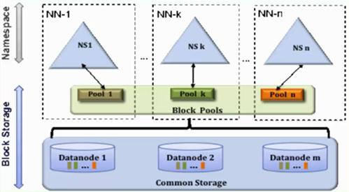
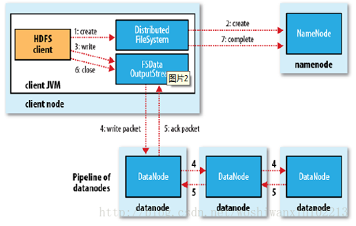
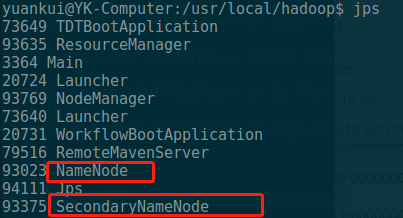

---
title: <font color=#0099ff face="微软雅黑">HDFS架构及原理</font>
date: 2018-04-20 10:18:23
categories: java多线程
tags: [大数据,hadoop,HDFS]
---

一、HDFS是做什么的
==============
HDFS（Hadoop Distributed File System）是Hadoop项目的核心子项目，是分布式计算中数据存储管理的基础，是基于流数据模式访问和处理超大文件的需求而开发的，可以运行于廉价的商用服务器上。
二、HDFS的特点
======================
* 适合大数据处理：处理数据达到 GB、TB、甚至PB级别的数据。能够处理百万规模以上的文件数量，数量相当之大。能够处理10K节点的规模。
* 流式数据访问：HDFS的构建思路是这样的:一次写入、多次读取是最高效的访问模式。数据集通常由数据源生成或从数据源复制而来，接着长时间在此数据集上进行各种分析。每次分析都将涉及该数据集的大部分数据甚至全部，因此读取整个数据集的时间延迟比读取第一条记录的时间延迟更重要。
（一次写入，多次读取。文件一旦写入不能修改，只能追加。）
* 商用硬件：Hadoop并不需要运行在昂贵且高可靠的硬件上。它是设计运行在商用硬件(在各种零售店都能买到的普通硬件)的集群上的，因此至少对于庞大的集群来说，节点故障的几率还是非常高的。HDFS遇到上述故障时，被设计成能够继续运行且不让用户察觉到明显的中断。（高容错性，适合批处理）
* 不适合低时间延迟的数据访问：要求低时间延迟数据访问的应用，例如几十毫秒范围，不适合在HDFS上运行。记住，HDFS是为高数据吞吐量应用优化的，这可能会以提高时间延迟为代价。目前，对于低延迟的访问需求，HBase是更好的选择。
* 不适合存储大量的小文件：由于namenode将文件系统的元数据存储在内存中，因此该文件系统所能存储的文件总数受限于namenode的内存容量。根据经验，每个文件、目录和数据块的存储信息大约占150字节。因此，举例来说，如果有一百万个文件，且每个文件占一个数据块，那至少需要占用namenode共300 MB的内存。尽管存储上百万个文件是可行的，但是存储数十亿个文件就超出了当前硬件的能力。(这里的小文件是指小于HDFS系统的Block大小的文件（默认64M)的话，它会占用 NameNode大量的内存来存储文件、目录和块信息。这样是不可取的，因为NameNode的内存总是有限的；另外小文件存储的寻道时间会超过读取时间，它违反了HDFS的设计目标）
* 多用户写入，任意修改文件：HDFS中的文件可能只有一个writer,而且写操作总是将数据添加在文件的末尾。它不支持具有多个写入者的操作，也不支持在文件的任意位置进行修改。（一个文件只能有一个写，不允许多个线程同时写，仅支持数据追加，不支持文件的随机修改）
三、HDFS核心概念
========
* 数据快(Block)：HDFS中的块默认为64MB，存储在HDFS中的文件都被划分为块大小的多个分块。HDFS中的块比磁盘中的块大很多的原因是为了最小化寻址开销。

* NameNode、DataNode、Secondary NameNode以及HDFS Client
HDFS 采用Master/Slave的架构来存储数据，这种架构主要由四个部分组成，分别为HDFS Client、NameNode、DataNode和Secondary NameNode。
1、NameNode：就是 master，即管理者。主要作用是管理HDFS的命名空间，它维护着文件系统树及整棵树内所有的文件和目录。这此信息以两个文件形式永久保存在本地磁盘上:命名空间镜像文件和编辑日志文件（fsimage和fsedits）。另外还具有管理数据块（Block）映射信息，配置副本策略，处理客户端的读写请求等功能。
2、DataNode：就是Slave，即工作节点或者数据节点。NameNode 下达命令，DataNode 执行实际的操作：存储实际的数据块；执行数据块的读/写操作。
3、Client：就是客户端。主要作用是文件切分，当文件上传HDFS的时候，Client 将文件切分成一个一个的Block，然后进行存储。还可以与NameNode交互，获取文件的位置信息；与DataNode交互，读取或者写入数据。Client也提供一些命令来管理HDFS，比如启动或者关闭HDFS，也可以通过一些命令来访问 HDFS。
4、Secondary NameNode：namenode一旦挂掉整个文件系统将不可用，所以对namenode的容错非常重要。Secondary NameNode就是用来进行namenode容错，但是它并非 NameNode 的热备。当NameNode 挂掉的时候，它并不能马上替换 NameNode 并提供服务。他的主要作用是定期合并fsimage和fsedits（命名空间镜像文件和编辑日志文件），并推送给NameNode。在紧急情况下，可辅助恢复 NameNode。

* NameNode Federation（联邦namenode）：



存在多个NameNode，每个NameNode分管一部分目录；NameNode共用DataNode，也就是说集群中的datanode需要注册到每一个namenode。
这样做的好处就是当NameNode内存受限时，能扩展内存，解决内存扩展问题，而且每个NameNode独立工作相互不受影响，比如其中一个NameNode挂掉了，它不会影响其他NameNode提供服务，但我们需要注意的是，虽然有多个NameNode，分管不同的目录，但是对于特定的NameNode，依然存在单点故障，因为没有它没有热备，解决单点故障使用NameNode HA。

* NameNode HA（高可用）
解决方案：
1、基于NFS（网络文件系统）共享方案：Active NameNode与Standby NameNode通过NFS实现共享数据，但如果Active NameNode与NFS之间或Standby NameNode与NFS之间，其中一处有网络故障的话，那就会造成数据同步问题。
2、基于Qurom Journal Manager(QJM)解决方案


Active NameNode和Standby NameNode：两台NameNode形成互备，一台处于Active状态，为主NameNode，另外一台处于Standby状态，为备NameNode，只有主NameNode才能对外提供读写服务。
主备切换控制器 ZKFailoverController：ZKFailoverController 作为独立的进程运行，对NameNode的主备切换进行总体控制。ZKFailoverController能通过心跳来检测到NameNode的健康状况，在主NameNode故障时借助 Zookeeper实现自动的主备选举和切换，当然 NameNode 目前也支持不依赖于 Zookeeper的手动主备切换。
Zookeeper集群：为主备切换控制器提供主备选举支持。
共享存储系统：共享存储系统是实现NameNode的高可用最为关键的部分，共享存储系统保存了NameNode在运行过程中所产生的HDFS的元数据。主NameNode和NameNode 通过共享存储系统实现元数据同步。在进行主备切换的时候，新的主NameNode在确认元数据完全同步之后才能继续对外提供服务。
DataNode节点：除了通过共享存储系统共享HDFS的元数据信息之外，主NameNode和备NameNode还需要共享HDFS的数据块和DataNode之间的映射关系。DataNode会同时向主NameNode和备NameNode上报数据块的位置信息。

详解：https://www.ibm.com/developerworks/cn/opensource/os-cn-hadoop-name-node/

四、HDFS读取文件
===================


HDFS的文件读取原理，主要包括以下几个步骤：
1、首先调用FileSystem对象的open方法，其实获取的是一个DistributedFileSystem的实例。
2、DistributedFileSystem通过RPC(远程过程调用)获得文件的第一批block的locations，同一block按照重复数会返回多个locations，这些locations按照hadoop拓扑结构排序，距离客户端近的排在前面。
3、前两步会返回一个FSDataInputStream对象，该对象会被封装成 DFSInputStream对象，DFSInputStream可以方便的管理datanode和namenode数据流。客户端调用read方法，DFSInputStream就会找出离客户端最近的datanode并连接datanode。
4、数据从datanode源源不断的流向客户端。
5、如果第一个block块的数据读完了，就会关闭指向第一个block块的datanode连接，接着读取下一个block块。这些操作对客户端来说是透明的，从客户端的角度来看只是读一个持续不断的流。
6、如果第一批block都读完了，DFSInputStream就会去namenode拿下一批blocks的location，然后继续读，如果所有的block块都读完，这时就会关闭掉所有的流。

五、HDFS写入文件
=========



HDFS的文件写入原理，主要包括以下几个步骤：
1、客户端通过调用 DistributedFileSystem 的create方法，创建一个新的文件。
2、DistributedFileSystem 通过 RPC（远程过程调用）调用 NameNode，去创建一个没有blocks关联的新文件。创建前，NameNode 会做各种校验，比如文件是否存在，客户端有无权限去创建等。如果校验通过，NameNode 就会记录下新文件，否则就会抛出IO异常。
3、前两步结束后会返回FSDataOutputStream的对象，和读文件的时候相似，FSDataOutputStream 被封装成 DFSOutputStream，DFSOutputStream 可以协调 NameNode和DataNode。客户端开始写数据到DFSOutputStream,DFSOutputStream会把数据切成一个个小packet，然后排成队列data queue。
4、DataStreamer会去处理接受data queue，它先问询NameNode这个新的 block 最适合存储的在哪几个DataNode里，比如重复数是3，那么就找到3个最适合的DataNode，把它们排成一个pipeline。DataStreamer把packet 按队列输出到管道的第一个DataNode中，第一个DataNode又把packet 输出到第二个DataNode 中，以此类推。
5、DFSOutputStream还有一个队列叫ack queue，也是由packet 组成，等待DataNode的收到响应，当pipeline中的所有DataNode都表示已经收到的时候，这时akc queue才会把对应的packet包移除掉。
6、客户端完成写数据后，调用close方法关闭写入流。
7、DataStreamer 把剩余的包都刷到 pipeline 里，然后等待 ack 信息，收到最后一个 ack 后，通知 DataNode 把文件标示为已完成。

六、HDFS副本存放策略
=====================
namenode如何选择在哪个datanode 存储副本（replication）？这里需要对可靠性、写入带宽和读取带宽进行权衡。Hadoop对datanode存储副本有自己的副本策略，在其发展过程中一共有两个版本的副本策略，分别如下所示：


七、HDFS常用命令
=================
安装完hadoop后，启动hdfs：
在hadoop目录下运行
```shell
./sbin/start-all.sh
```
来启动所有相关组件。
使用
```shell
jps
```
来查看进程：



```shell
hadoop dfs -ls /    #列出HDFS下的文件
hadoop dfs -ls -R /  #递归列出目录内容
hadoop dfs -ls -R /  #递归列出目录内容
hadoop dfs -put test test_two  #将hadoop目录下的test文件上传到HDFS上并重命名为test_two
hadoop dfs-copyFromLocal /usr/local/filecontent/wordsTest001 /user/root/test #也是将本地文件上传到hdfs
hadoop dfs -moveFromLocal /usr/local/filecontent/word  /user/root/test #本地文件系统移动到HDFS上
hadoop dfs -get in getin #将HDFS中的in文件复制到本地系统并命名为getin
hadoop dfs -moveToLocal  /user/root/test/word /usr/local/filecontent/ #下载Hdfs上面的文件到本地
hadoop dfs -df /hbase  #查看hbase目录使用情况
hadoop dfs -du / #显示目录中所有文件及目录大小
hadoop dfs -count /<路径>    #加上-q参数可查看文件索引，显示指定路径 下的目录数以及文件数，输出格式：目录数 文件数  大小  文件名
hadoop dfs -mv /user/root/test001 /user/root/test #将HDFS上面的文件移动到目的文件夾
hadoop dfs -rm /user/root/test/test001 #删除文件(移动到回收站)
hadoop dfs -expunge #清空回收站
hadoop dfs -rm -skipTrash /user/root/test/test001 #直接删除
hadoop dfs -cat /user/root/test/word #查看Hdfs上面文本的内容
hadoop dfs -text /user/root/test/word #也是查看Hdfs上面文本的内容
hadoop dfs -mkdir  /user/test001 #在HDFS上创建目录
hadoop dfs -touchz /user/root/test001 #创建文件
hadoop dfs -test -e  /user/test001/wordp  #检查Hdfs上面文件路径，-e检查文件是否存在   -z检查文件是否为0字节  -d表示是目录，返回1，否则0
hadoop dfs -tail -f /user/root/test/word   #-f选项的内容会随着文件内容更新而更新
hadoop dfs -chmod -R 777 /user/root/test/word    #HDFS改变文件或目录权限，-R表示递归
```


