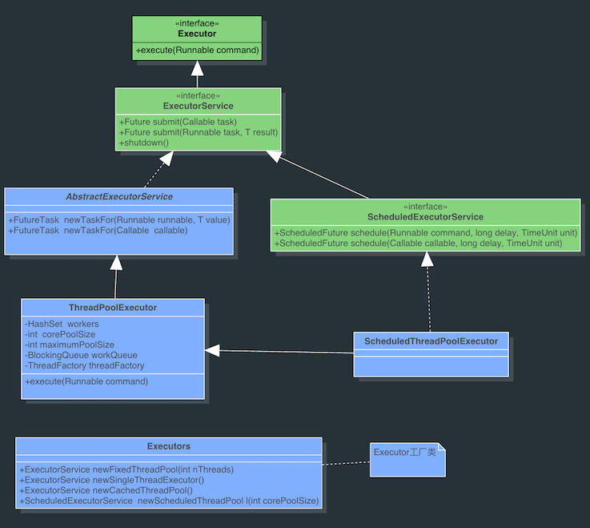
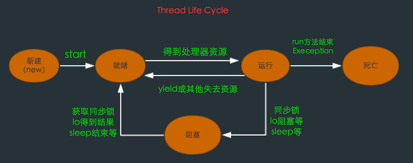
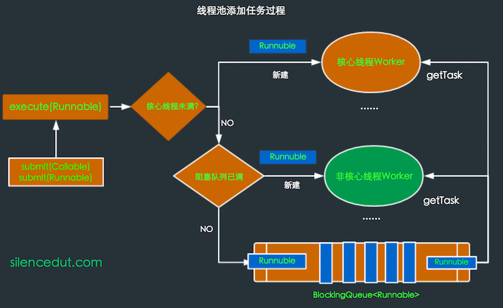

背景
==========
在面向对象编程中，创建和销毁对象是很费时间的，因为创建一个对象要获取内存资源或者其它更多资源。在Java中更是如此，虚拟机将试图跟踪每一个对象，以便能够在对象销毁后进行垃圾回收。

所以提高服务程序效率的一个手段就是尽可能减少创建和销毁对象的次数，特别是一些很耗资源的对象创建和销毁。如何利用已有对象来服务就是一个需要解决的关键问题，其实这就是一些”池化资源”技术产生的原因。

例如Android中常见到的很多通用组件一般都离不开”池”的概念，如各种图片加载库，网络请求库，即使Android的消息传递机制中的Meaasge当使用Meaasge.obtain()就是使用的Meaasge池中的对象，因此这个概念很重要。本文将介绍的线程池技术同样符合这一思想。

线程池的优点:

 - 重用线程池中的线程,减少因对象创建,销毁所带来的性能开销;
 - 能有效的控制线程的最大并发数,提高系统资源利用率,同时避免过多的资源竞争,避免堵塞;
 - 能够多线程进行简单的管理,使线程的使用简单、高效。

线程池框架Executor
===========
java中的线程池是通过Executor框架实现的，Executor框架包括类：Executor，Executors，ExecutorService，ThreadPoolExecutor ，Callable和Future、FutureTask的使用等。


**Executor**: 所有线程池的接口,只有一个方法。
```java
public interface Executor {
    void execute(Runnable command);
}
```
**ExecutorService**: 增加Executor的行为，是Executor实现类的最直接接口。
**Executors**： 提供了一系列工厂方法用于创建线程池，返回的线程池都实现了ExecutorService接口。
**ThreadPoolExecutor**：线程池的具体实现类,一般用的各种线程池都是基于这个类实现的。
构造方法如下:
```java
public ThreadPoolExecutor(int corePoolSize, int maximumPoolSize, long keepAliveTime, 
                    TimeUnit unit, BlockingQueue<Runnable> workQueue) {
 
    this(corePoolSize, maximumPoolSize, keepAliveTime, unit, workQueue,
    Executors.defaultThreadFactory(), defaultHandler);
 
}
```
其中各个参数的含义：

 1. corePoolSize：线程池的核心线程数,默认情况下可以一直存活。可以设置allowCoreThreadTimeOut为True,此时 核心线程数就是0,就可以用keepAliveTime控制所有线程的超时时间。
 2. maximumPoolSize：线程池允许的最大线程数;
 3. keepAliveTime： 指的是空闲线程结束的超时时间;
 4. unit ：是一个枚举，表示 keepAliveTime 的单位;
 5. workQueue：表示存放任务的BlockingQueue<Runnable队列。
 6. BlockingQueue:阻塞队列（BlockingQueue）是java.util.concurrent下的主要用来控制线程同步的工具。如果BlockQueue是空的,从BlockingQueue取东西的操作将会被阻断进入等待状态,直到BlockingQueue有数据才会被唤醒。同样,如果BlockingQueue是满的,任何试图往里存东西的操作也会被阻断进入等待状态,直到BlockingQueue里有空间才会被唤醒继续操作。具体的实现类有LinkedBlockingQueue,ArrayBlockingQueued,DelayQueue,PriorityBlockingQueue等。
 
线程池的工作过程：
=============
线程池刚创建时，里面没有一个线程。任务放在阻塞队列中作为参数传进来的。不过，就算队列里面有任务，线程池也不会马上执行它们。
当调用 execute() 方法添加一个任务时，线程池会做如下判断：

 7. 如果正在运行的线程数量小于 corePoolSize，那么马上创建线程运行这个任务；
 8. 如果正在运行的线程数量大于或等于 corePoolSize，那么将这个任务放入队列；
 9. 如果这时候队列满了，而且正在运行的线程数量小于maximumPoolSize，那么还是要创建非核心线程立刻运行这个任务；
 10. 如果队列满了，而且正在运行的线程数量大于或等于maximumPoolSize，那么线程池会抛出异常RejectExecutionException。

当一个线程完成任务时，它会从队列中取下一个任务来执行。
当一个线程无事可做，超过一定的时间（keepAliveTime）时，线程池会判断，如果当前运行的线程数大于 corePoolSize，那么这个线程就被停掉。所以线程池的所有任务完成后，它最终会收缩到 corePoolSize 的大小。

线程池的创建和使用
===============
线程池的生成：
--------
生成线程池采用了工具类Executors的静态方法，以下是几种常见的线程池。

 - SingleThreadExecutor：单个后台线程 (其缓冲队列是无界的)

```java
 public static ExecutorService newSingleThreadExecutor() {
    return new FinalizableDelegatedExecutorService ( new ThreadPoolExecutor(1, 1,
                              0L, TimeUnit.MILLISECONDS, new LinkedBlockingQueue<Runnable>()));
}
```
创建一个单线程的线程池。可以看到maximumPoolSize和corePoolSize都是1，这个线程池只有一个核心线程在工作，也就是相当于单线程串行执行所有任务。如果这个唯一的线程因为异常结束，那么会有一个新的线程来替代它。此线程池保证所有任务的执行顺序按照任务的提交顺序执行。

 - FixedThreadPool：只有核心线程的线程池,大小固定 (其缓冲队列是无界的) 。

```java
public static ExecutorService newFixedThreadPool(int nThreads) {
    return new ThreadPoolExecutor(nThreads, nThreads, 0L, TimeUnit.MILLISECONDS,
                            new LinkedBlockingQueue<Runnable>());
}
```
创建固定大小的线程池。可以看到maximumPoolSize和corePoolSize相等，每次提交一个任务就创建一个线程，直到线程达到线程池的最大大小。线程池的大小一旦达到最大值就会保持不变，如果某个线程因为执行异常而结束，那么线程池会补充一个新线程。

 - CachedThreadPool：无界线程池，可以进行自动线程回收。
 
```java
public static ExecutorService newCachedThreadPool() {
        return new ThreadPoolExecutor(0,Integer.MAX_VALUE, 60L, TimeUnit.SECONDS,
                            new SynchronousQueue<Runnable>());
}
```
创建一个无界的线程池，可以看到corePoolSize是0，而maximumPoolSize是整型数的最大值。当任务数增加时，此线程池可以智能的添加新线程来处理任务，而如果线程池的大小超过了处理任务所需要的线程，那么就会回收部分空闲（60秒不执行任务）的线程。此线程池不会对线程池大小做限制，线程池大小完全依赖于操作系统（或者说JVM）能够创建的最大线程大小。SynchronousQueue是一个是缓冲区为1的阻塞队列。

 - ScheduledThreadPool：核心线程池固定，大小无限的线程池。此线程池支持定时以及周期性执行任务的需求。

```java
public static ExecutorService newScheduledThreadPool(int corePoolSize) {
    return new ScheduledThreadPool(corePoolSize,Integer.MAX_VALUE,DEFAULT_KEEPALIVE_MILLIS,
                                MILLISECONDS,new DelayedWorkQueue());
}
```
创建一个周期性执行任务的线程池。如果闲置,非核心线程池会在DEFAULT_KEEPALIVEMILLIS时间内回收。DleayQueue是一个延迟阻塞队列，它实现了Delayed接口，只有达到指定延迟时间才能从里面取出数据，然后交由线程池中的线程去处理。

 - 定制自己的线程池：
 
除此之外我们也可以定制自己的线程池：比如要实现一个优先级线程池，只需要把PriorityBlockingQueue作为参数传入到线程池中去:
```java
public static ExecutorService newPriorityThreadPool(int corePoolSize, int maximumPoolSize, 
            long keepAliveTime, TimeUnit unit, PriorityBlockingQueue<Runnable> workQueue){
    return new ThreadPoolExecutor(corePoolSize, maximumPoolSize, keepAliveTime, unit,
                            workQueue);                                  
}
```
所有任务都实现了Comparable和Runable接口，所以当无法直接向线程池中提交任务的时候，任务就会加入优先级阻塞队列PriorityBlockingQueue中去，PriorityBlockingQueue就会用Comparable接口中的compareTo方法来确定优先级。所以之后就会按优先级向线程池提交任务。但是注意，最开始的corePoolSize个任务由于是直接提交给线程池的，没有加入到PriorityBlockingQueue，所以是按提交顺序去执行而不是优先级。

线程池提交任务的方法：
-------------
1、execute:
```java
ExecutorService.execute(Runnable runable)；
```
2、submit:
```java
FutureTask task = ExecutorService.submit(Runnable runnable);

FutureTask<T> task = ExecutorService.submit(Runnable runnable,T Result);
 
FutureTask<T> task = ExecutorService.submit(Callable<T> callable);
```
可以去看一看submit方法是怎么实现的，下面列出了submit(Callable callable)的实现源码，submit(Runnable runnable)方法其实也是差不多的：
```java
public <T> Future<T> submit(Callable<T> task) {
    if (task == null) throw new NullPointerException();
    FutureTask<T> ftask = newTaskFor(task);
    execute(ftask);
    return ftask;
}
```
可以看出submit开启的是有返回结果的任务，会返回一个FutureTask对象，这样就能通过get()方法得到任务执行的结果。其实submit最终调用的也是execute(Runnable runable)，submit只是将Callable对象或Runnable封装成一个FutureTask对象，因为FutureTask是个Runnable，所以可以在execute中执行。

线程池的实现原理：
==================
线程池的实现过程没有用到Synchronized关键字，用的都是volatile,Lock和同步(阻塞)队列,Atomic相关类，FutureTask等等，因为后者的性能更优。理解的过程可以很好的学习源码中并发控制的思想。在开篇提到过线程池的优点是可总结为以下三点：线程复用，控制最大并发数和管理线程这三点，下面从这三个方面入手：
线程复用过程：
----------
理解线程复用原理首先应了解普通线程的生命周期（注意：是线程的生命周期，不是线程池的生命周期）：

在线程的生命周期中，它要经过新建(New)、就绪（Runnable）、运行（Running）、阻塞(Blocked)和死亡(Dead)5种状态。

我们可以通过Thread类的new()方法来新建一个线程，这个过程是是初始化一些线程信息，如线程名，id,线程所属group等，可以认为只是个普通的对象。新建的线程处于新建状态，而通过调用Thread的start()后，Java虚拟机会为其创建方法调用栈和程序计数器，同时将hasBeenStarted为true,这是线程进入就绪状态，如果这之后再调用start方法就会有异常，所以整个生命周期中start()方法只调用一次。
处于就绪状态的线程并没有开始运行，只是表示该线程可以运行了。至于该线程何时开始运行，取决于JVM里线程调度器的调度。当线程获取cpu后，run()方法会被调用。注意，不要自己去调用Thread的run()方法，系统会自己去调用。之后线程会根据CPU的调度在就绪——运行——阻塞之间切换，直到run()方法结束或其他方式停止线程，进入dead状态。

所以实现线程复用的原理应该就是要保持线程处于存活状态（就绪，运行或阻塞）。接下来来看下ThreadPoolExecutor是怎么实现线程复用的，在ThreadPoolExecutor类中有一个内部类Worker，主要就是这个Worker类来控制线程的复用。看下Worker类简化后的代码，这样方便理解：
```java
private final class Worker implements Runnable {
 
    final Thread thread;
     
    Runnable firstTask;
     
    Worker(Runnable firstTask) {
        this.firstTask = firstTask;
        this.thread = getThreadFactory().newThread(this);
    }
     
    public void run() {
        runWorker(this);
    }
     
    final void runWorker(Worker w) {
        Runnable task = w.firstTask;
        w.firstTask = null;
        while (task != null || (task = getTask()) != null){
            task.run();
        }
    }
    
    private Runnable getTask() {
        if(一些特殊情况) {
            return null;
        }
        Runnable r = workQueue.take();
        return r;
    }
 
}
```
Worker是一个实现Runnable接口的对象，同时拥有一个thread，这个thread就是要开启的线程，在调用worker构造方法新建Worker对象的同时会新建一个Thread对象，新建这个Tread对象的时候会将Worker自己作为参数传入进去，这样当Thread的start()方法调用时，线程进入就绪状态，之后获得cpu去运行的时候运行的实际上是Worker的run()方法，worker的run()方法会调用runWorker()方法,runWorker()中有个while循环，会一直从getTask()方法里得到Runnable对象(具体的任务)，然后调用这些Runable对象的run()方法(task.run())去顺序执行。可以看到getTask()方法中有一个workQueue，这个就是初始化TreadPoolExecutor时存放任务的BlockingQueue队列。这个队列中存放的都是将要执行的Runable任务。因为BlockingQueue是个阻塞队列，BlockingQueue.take()如果是空，则进入等待阻塞状态直到BlockingQueue中有新的对象加入时唤醒阻塞的线程。所以一般情况Tread的run()方法就不会结束，而是不断执行从workQueue里取得任务去执行，这就达到线程复用的原理了。

控制最大并发数
---------------
Runnable对象是什么时候放入workQueue？Worker又是什么时候创建，Worker里的Thread的又是什么时候调用start()开启新线程来执行Worker的run()方法的呢？有上面的分析看出Worker里的runWorker()执行任务时是一个接一个，串行进行的，那并发是怎么体现的呢？

这些是由ThreadPoolExecutor类中的execute()方法保证的，以下是简化后的代码：
```java
public void execute(Runnable command) {
    if (command == null)
        throw new NullPointerException();

     int c = ctl.get();
    // 当前线程数 < corePoolSize
    if (workerCountOf(c) < corePoolSize) {
        // 直接启动新的线程。
        if (addWorker(command, true))
            return;
        c = ctl.get();
    }

    // 活动线程数 >= corePoolSize
    // runState为RUNNING && 队列未满
    if (isRunning(c) && workQueue.offer(command)) {
        int recheck = ctl.get();
        // 再次检验是否为RUNNING状态
        // 非RUNNING状态 则从workQueue中移除任务并拒绝
        if (!isRunning(recheck) && remove(command))
            reject(command);// 采用线程池指定的策略拒绝任务
        // 两种情况：
        // 1.非RUNNING状态拒绝新的任务
        // 2.队列满了启动新的线程失败（workCount > maximumPoolSize）
    } else if (!addWorker(command, false))
        reject(command);
}

private boolean addWorker(Runnable firstTask, boolean core) {
    int wc = workerCountOf(c);
    if (wc >= (core ? corePoolSize : maximumPoolSize)) {
        return false;
    }
    w = new Worker(firstTask);
    final Thread t = w.thread;
    t.start();
}
```
根据代码再来看上面提到的线程池工作过程中的添加任务的情况：

* 如果正在运行的线程数量小于 corePoolSize，那么马上创建线程运行这个任务；   
* 如果正在运行的线程数量大于或等于 corePoolSize，那么将这个任务放入队列；
* 如果这时候队列满了，而且正在运行的线程数量小于maximumPoolSize，那么还是要创建非核心线程立刻运行这个任务；
* 如果队列满了，而且正在运行的线程数量大于或等于maximumPoolSize，那么线程池会抛出异常RejectExecutionException；

通过addWorker如果成功创建新的线程成功，则通过start()开启新线程，同时将firstTask作为这个Worker里的run()中执行的第一个任务。虽然每个Worker的任务是串行处理，但如果创建了多个Worker，因为共用一个workQueue，所以就会并行处理了。所以根据corePoolSize和maximumPoolSize来控制最大并发数。大致过程可用下图表示:


管理线程
-------------
通过线程池可以很好的管理线程的复用，控制并发数，以及销毁等过程,线程的复用和控制并发上面已经讲了，而线程的管理过程已经穿插在其中了，也很好理解。
在ThreadPoolExecutor有个ctl的AtomicInteger变量。通过这一个变量保存了两个内容：

 * 所有线程的数量
 * 每个线程所处的状态

其中低29位存线程数，高3位存runState，通过位运算来得到不同的值。
```java
private final AtomicInteger ctl = new AtomicInteger(ctlOf(RUNNING, 0));

//得到线程的状态
private static int runStateOf(int c) {
    return c & ~CAPACITY;
}

//得到Worker的的数量
private static int workerCountOf(int c) {
    return c & CAPACITY;
}

// 判断线程是否在运行
private static boolean isRunning(int c) {
    return c < SHUTDOWN;
}
```
这里主要通过shutdown()和shutdownNow()来分析线程池的关闭过程。这两个方法是关闭线程池的方法。首先线程池有五种状态来控制任务添加与执行。主要介绍以下三种：

 * RUNNING状态：线程池正常运行，可以接受新的任务并处理队列中的任务；
 * SHUTDOWN状态：不再接受新的任务，但是会执行队列中的任务；
 * STOP状态：不再接受新任务，不处理队列中的任务

shutdown这个方法会将runState置为SHUTDOWN，会终止所有空闲的线程，而仍在工作的线程不受影响，所以队列中的任务仍会被执行，但是线程池不再接受新的任务。shutdownNow方法则将runState置为STOP。和shutdown方法的区别，这个方法会终止所有的线程，所以队列中的任务也不会被执行了，不过线程中正在执行的任务不会突然中断，而是执行完之后线程才会关闭。


