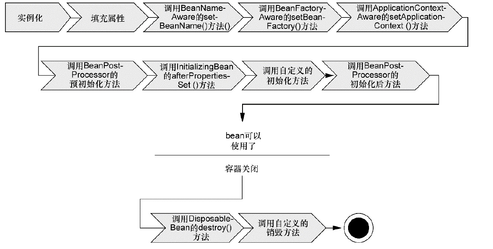
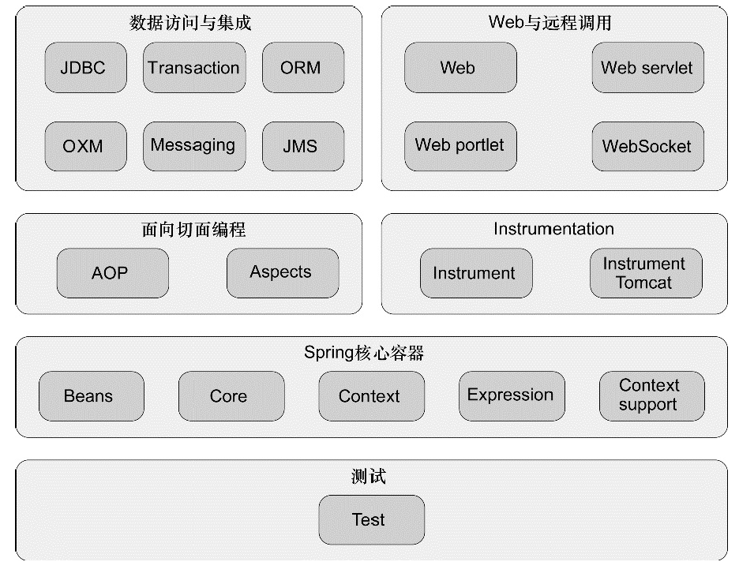

在基于Spring的应用中，你的应用对象生存于Spring容器（container）中。Spring容器负责创建对象，装配它们，配置它们并管理它们的整个生命周期，从生存到死亡（在这里，可能就是new到finalize()）。容器是Spring框架的核心。Spring容器使用DI管理构成应用的组件，它会创建相互协作的组件之间的关联。

Spring容器并不是只有一个。Spring自带了多个容器实现，可以归为两种不同的类型。**bean工厂**（由org.springframework.beans.factory.eanFactory接口定义）是最简单的容器，提供基本的DI支持。**应用上下文**（由org.springframework.context.ApplicationContext接口定义）基于BeanFactory构建，并提供应用框架级别的服务，例如从属性文件解析文本信息以及发布应用事件给感兴趣的事件监听者。但是实际应用中，我们往往都会使用应用上下文。

使用应用上下文
=====
Spring自带了多种类型的应用上下文。下面罗列的几个是你最有可能遇到的：

- AnnotationConfigApplicationContext：从一个或多个基于Java的配置类中加载Spring应用上下文。
- AnnotationConfigWebApplicationContext：从一个或多个基于Java的配置类中加载SpringWeb应用上下文。
- ClassPathXmlApplicationContext：从类路径下的一个或多个XML配置文件中加载上下文定义，把应用上下文的定义文件作为类资源。
- FileSystemXmlapplicationcontext：从文件系统下的一个或多个XML配置文件中加载上下文定义。
- XmlWebApplicationContext：从Web应用下的一个或多个XML配置文件中加载上下文定义。

如下代码展示了如何加载一个FileSystemXmlApplicationContext：
```java
ApplicationContext context = new FileSystemXmlApplicationContext("c:/knight.xml");
```
类似地，也可以使用ClassPathXmlApplicationContext从应用的类路径下加载应用上下文：
```java
ApplicationContext context = new ClassPathXmlApplicationContext("knight.xml");
```
使用FileSystemXmlApplicationContext和使用ClassPathXmlApplicationContext的区别在于：FileSystemXmlApplicationContext在指定的文件系统路径下查找knight.xml文件；而ClassPathXmlApplicationContext是在所有的类路径（包含JAR文件）下查找knight.xml文件。

如果你想从Java配置中加载应用上下文，那么可以使用AnnotationConfigApplicationContext：
```java
ApplicationContext context = new AnnotaionConfigApplicationContext(
    com.springinaction.knights.config.knightconfig.class);
```
在这里没有指定加载Spring应用上下文所需的XML文件，AnnotationConfigApplicationContext通过一个配置类加载bean。

应用上下文准备就绪之后，我们就可以调用上下文的getBean()方法从Spring容器中获取bean。

bean的生命周期
=======


对上图进行详细描述：
1．Spring对bean进行实例化；
2．Spring将值和bean的引用注入到bean对应的属性中；
3．如果bean实现了BeanNameAware接口，Spring将bean的ID传递给setBeanName()方法；
4．如果bean实现了BeanFactoryAware接口，Spring将调用setBeanFactory()方法，将BeanFactory容器实例传入；
5．如果bean实现了ApplicationContextAware接口，Spring将调用setApplicationContext()方法，将bean所在的应用上下文的引用传入进来；
6．如果bean实现了BeanPostProcessor接口，Spring将调用它们的postProcessBeforeInitialization()方法；
7．如果bean实现了InitializingBean接口，Spring将调用它们的afterPropertiesSet()方法。类似地，如果bean使用initmethod声明了初始化方法，该方法也会被调用；
8．如果bean实现了BeanPostProcessor接口，Spring将调用它们的postProcessAfterInitialization()方法；
**9．此时，bean已经准备就绪，可以被应用程序使用了，它们将一直驻留在应用上下文中，直到该应用上下文被销毁；**
10．如果bean实现了DisposableBean接口，Spring将调用它的destroy()接口方法。同样，如果bean使用destroymethod声明了销毁方法，该方法也会被调用。

Spring模块
============

**Spring核心容器**
容器是Spring框架最核心的部分，它管理着Spring应用中bean的创建、配置和管理。在该模块中，包括了Springbean工厂，它为Spring提供了DI的功能。基于bean工厂，我们还会发现有多种Spring应用上下文的实现，每一种都提供了配置Spring的不同方式。除了bean工厂和应用上下文，该模块也提供了许多企业服务，例如E-mail、JNDI访问、EJB集成和调度。所有的Spring模块都构建于核心容器之上。当你配置应用时，其实你隐式地使用了这些类。
**Spring的AOP模块**
在AOP模块中，Spring对面向切面编程提供了丰富的支持。这个模块是Spring应用系统中开发切面的基础。与DI一样，AOP可以帮助应用对象解耦。借助于AOP，可以将遍布系统的关注点（例如事务和安全）从它们所应用的对象中解耦出来。
**数据访问与集成**
使用JDBC编写代码通常会导致大量的样板式代码，例如获得数据库连接、创建语句、处理结果集到最后关闭数据库连接。Spring的JDBC和DAO（Data Access Object）模块抽象了这些样板式代码，使我们的数据库代码变得简单明了，还可以避免因为关闭数据库资源失败而引发的问题。该模块在多种数据库服务的错误信息之上构建了一个语义丰富的异常层，以后我们再也不需要解释那些隐晦专有的SQL错误信息了！
对于那些更喜欢ORM（Object Relational Mapping）工具而不愿意直接使用JDBC的开发者，Spring提供了ORM模块。Spring的ORM模块建立在对DAO的支持之上，并为多个ORM框架提供了一种构建DAO的简便方式。Spring没有尝试去创建自己的ORM解决方案，而是对许多流行的ORM框架进行了集成，包括Hibernate、Java Persisternce API、Java Data Object和iBATIS SQL Maps。Spring的事务管理支持所有的ORM框架以及JDBC。
本模块同样包含了在JMS（Java Message Service）之上构建的Spring抽象层，它会使用消息以异步的方式与其他应用集成。从Spring 3.0开
始，本模块还包含对象到XML映射的特性，它最初是Spring WebService项目的一部分。
除此之外，本模块会使用Spring AOP模块为Spring应用中的对象提供事务管理服务。
**Web与远程调用**
MVC（Model-View-Controller）模式是一种普遍被接受的构建Web应用的方法，它可以帮助用户将界面逻辑与应用逻辑分离。Java从来不缺少MVC框架，Apache的Struts、JSF、WebWork和Tapestry都是可选的最流行的MVC框架。虽然Spring能够与多种流行的MVC框架进行集成，但它的Web和远程调用模块自带了一个强大的MVC框架，这就是SpringMVC框架，有助于在Web层提升应用的松耦合水平。
除了面向用户的Web应用，该模块还提供了多种构建与其他应用交互的远程调用方案。Spring远程调用功能集成了RMI（Remote Method Invocation）、Hessian、Burlap、JAX-WS，同时Spring还自带了一个远程调用框架：HTTPinvoker。Spring还提供了暴露和使用REST API的良好支持。
**Instrumentation**
Spring的Instrumentation模块提供了为JVM添加代理（agent）的功能。具体来讲，它为Tomcat提供了一个织入代理，能够为Tomcat传递类文件，就像这些文件是被类加载器加载的一样。
**测试**
鉴于开发者自测的重要性，Spring提供了测试模块以致力于Spring应用的测试。通过该模块，你会发现Spring为使用JNDI、Servlet和Portlet编写单元测试提供了一系列的mock对象实现。对于集成测试，该模块为加载Spring应用上下文中的bean集合以及与Spring上下文中的bean进行交互提供了支持。

SpringBoot
=====
Spring极大地简化了众多的编程任务，减少甚至消除了很多样板式代码，如果没有Spring的话，在日常工作中你不得不编写这样的样板代码。SpringBoot是一个崭新的令人兴奋的项目，它以Spring的视角，致力于简化Spring本身。**SpringBoot大量依赖于自动配置技术，它能够消除大部分（在很多场景中，甚至是全部）Spring配置。它还提供了多个Starter项目，不管你使用Maven还是Gradle，这都能减少Spring工程构建文件的大小。**